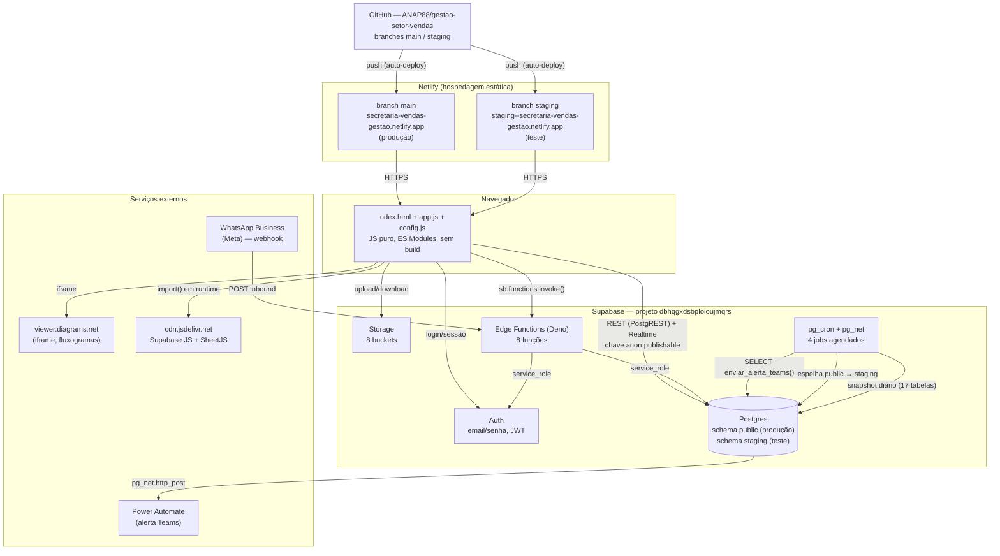

# Arquitetura

## Visão geral

O sistema é deliberadamente simples na sua composição: **3 arquivos estáticos no navegador** +
**um projeto Supabase** (Postgres + Auth + Storage + Edge Functions + `pg_cron`) + **hospedagem
estática no Netlify**. Não há servidor de aplicação próprio, não há build step, não há
framework de front-end.

## As camadas

### 1. Front-end — `index.html` + `app.js` + `config.js`

- **Sem framework** (nada de React/Vue/Angular), sem TypeScript, sem bundler (Webpack/Vite/etc).
- `app.js` é um único módulo ES (`<script type="module" src="./app.js">`), ~8.200 linhas, ~534 KB.
- Todo o roteamento é feito à mão: um objeto de estado em memória (`state`) e uma função
  `render()` que troca o conteúdo da `
` principal conforme `state.view`.
- Duas dependências de terceiros, ambas carregadas via CDN **em tempo de execução** (não
  empacotadas): `@supabase/supabase-js@2` (import estático no topo do arquivo) e `xlsx@0.18.5`
  (SheetJS, importado dinamicamente só nas telas que leem/exportam planilha). Ver
  [INTEGRACOES.md](INTEGRACOES.md) para o risco de a versão do Supabase JS não estar fixada.
- `config.js` é o **único arquivo com dado de ambiente**: URL do projeto Supabase e a chave
  pública (`anon`/`publishable`). Não guarda segredo real — a chave é pública por design, a
  segurança de verdade está no RLS do Postgres (ver [SEGURANCA.md](SEGURANCA.md)).
- O mesmo front-end serve **dois "aplicativos"** dependendo da URL: o sistema interno da equipe
  (rota raiz) e o **Portal do Incorporador/Cliente** (rota `/portal` ou `/portal/<slug>`), com
  sessões de login separadas (chaves diferentes no `localStorage`) para não derrubar uma ao usar
  a outra na mesma máquina.

### 2. Supabase — banco, autenticação, arquivos e automação de borda

Um único projeto Supabase (`dbhqgxdsbploioujmqrs`, região `sa-east-1`) hospeda **dois ambientes
lógicos no mesmo Postgres**, via dois schemas:

- **`public`** — produção.
- **`staging`** — ambiente de teste, com a mesma estrutura de tabelas, funções, triggers e
  views, e uma cópia dos dados de produção **atualizada 1x por dia** (`pg_cron`, 06:30 UTC, via
  `staging.atualizar_espelho()` — trunca e reinsere 37 tabelas listadas na função). Escolhido no
  lugar de um segundo projeto Supabase para não precisar de um plano pago só para isso.
- Qual schema o front-end usa é decidido **no navegador**, por `location.hostname`: qualquer
  domínio que não seja exatamente `secretaria-vendas-gestao.netlify.app` conta como staging.
  Ver [BANCO-DE-DADOS.md](BANCO-DE-DADOS.md#staging-vs-public) para as diferenças reais de
  comportamento entre os dois schemas (não são 100% idênticos hoje).
- **Auth**: só e-mail/senha (nenhum provedor OAuth configurado — confirmado via
  `auth.identities`, 100% `provider = 'email'`). Ver [AUTENTICACAO.md](AUTENTICACAO.md).
- **Storage**: 8 buckets, a maioria privada com policy por papel; 2 públicos. Ver
  [BANCO-DE-DADOS.md](BANCO-DE-DADOS.md#storage).
- **Edge Functions**: 8 funções Deno, usadas para as poucas ações que exigem a chave
  `service_role` (criar/excluir/resetar usuário, ler um site externo, disparar alerta manual) —
  tudo que a chave pública não tem permissão de fazer sozinha. Ver [API.md](API.md).
- **`pg_cron` + `pg_net`**: 4 jobs agendados rodando **dentro do próprio Postgres**, sem
  depender de nenhum serviço externo de agendamento:

  | Job | Horário (UTC) | O que faz |
  |---|---|---|
  | `alerta-plantao-12h` | 15:00 (12h Brasília) | `enviar_alerta_teams()` |
  | `alerta-plantao-17h` | 20:00 (17h Brasília) | `enviar_alerta_teams()` |
  | `backup-diario-interno` | 06:00 (03h Brasília) | `backup.rodar_snapshot_diario()` |
  | `espelho-staging-diario` | 06:30 (03h30 Brasília) | `staging.atualizar_espelho()` |

  Os dois primeiros são o motivo de o `README.md` da raiz falar em "alertas às 12h/17h"; os dois
  últimos (backup e espelho de staging) **não estavam documentados em nenhum lugar do repositório
  antes deste handover** — só existiam como jobs no banco.

### 3. Netlify — hospedagem estática

- Site `secretaria-vendas-gestao` (id `37305d4c-e0cf-4ac1-9162-9a0c473472e6`), plano de time
  (`nf_team_dev`).
- `build.command` é literalmente `echo 'Static site - no build needed'` — não há passo de build
  de verdade, o Netlify só publica os arquivos do repositório como estão.
- Deploy automático a cada `git push`: branch `main` publica em produção
  (`secretaria-vendas-gestao.netlify.app`), branch `staging` publica no subdomínio de branch
  (`staging--secretaria-vendas-gestao.netlify.app`).
- Cabeçalhos de segurança e cache são definidos **duas vezes**, de forma redundante mas
  consistente: em `netlify.toml` (`[[headers]]`) e em `_headers` (formato nativo do Netlify).
  Ver [INFRAESTRUTURA.md](INFRAESTRUTURA.md).
- Por ser 100% estático, qualquer host de arquivos (S3, Cloudflare Pages, IIS interno, nginx)
  serve igualmente — não há lock-in de hospedagem. Isso já está documentado em
  `TRANSFERENCIA.md` na raiz do repositório, com passo a passo inclusive para IIS interno.

### 4. GitHub — controle de versão e gatilho de deploy

- Repositório `ANAP88/gestao-setor-vendas`, público (confirmado por `git remote`; visibilidade e
  lista de colaboradores exatos **não foram conferidas** — precisa acessar github.com
  diretamente, não há `gh` CLI disponível no ambiente usado nesta auditoria).
- Duas branches: `main` (produção) e `staging` (teste). Sem GitHub Actions/workflows (nenhum
  arquivo em `.github/`) — todo o "CI" é, na prática, o próprio deploy automático do Netlify.
- Disciplina observada no histórico: mudanças são feitas em `staging`, validadas no ambiente de
  teste, e só depois mescladas (`merge`) em `main`.

## Fluxo de uma requisição típica

1. Usuário abre a URL → Netlify serve `index.html`/`app.js`/`config.js` (arquivos estáticos, sem
   processamento no servidor).
2. `app.js` decide, pelo `hostname`, qual **schema** do Postgres usar, e cria um client Supabase
   com a chave pública.
3. Login: `sb.auth.signInWithPassword` contra o Supabase Auth (mais duas RPCs próprias de rate
   limiting, ver [AUTENTICACAO.md](AUTENTICACAO.md)).
4. Toda leitura/escrita de dado depois do login vai direto do navegador para a API REST
   automática do Postgres (**PostgREST**, embutida no Supabase) — não existe uma camada de
   backend própria no meio. Quem garante que cada usuário só vê/edita o que pode é o **RLS do
   Postgres** (Row Level Security), não o `app.js`.
5. As 5 ações que exigem privilégio elevado (criar usuário, etc.) chamam uma Edge Function em vez
   de ir direto ao Postgres — a Edge Function usa a chave `service_role` (nunca exposta ao
   navegador) para fazer o que a chave pública não pode.

## Decisões de design deliberadas (e por quê)

Já documentadas no `README.md` da raiz do projeto, resumidas aqui porque afetam diretamente como
alguém deve pensar em mudar a arquitetura:

- **Sem build step**: reduz "funciona na minha máquina" a quase zero e permite que qualquer
  pessoa com editor de texto entenda e edite o sistema.
- **RLS de verdade, não só esconder botão**: todo controle de acesso é reforçado no banco.
- **Staging como schema, não projeto separado**: economiza custo de infraestrutura.
- **Fluxo da esteira é dado, não código**: etapas/transições da Esteira (`etapas_esteira`,
  `esteira_transicoes`) são editáveis pela própria interface (Administração → Fluxos da
  Esteira), sem precisar de deploy para mudar o fluxo de aprovação de crédito.

## O que NÃO existe (para não presumir)

- Nenhum backend próprio (Node/Python/etc.) — só Postgres + Edge Functions.
- Nenhum sistema de filas/mensageria.
- Nenhum pipeline de CI/CD além do deploy automático do Netlify.
- Nenhum framework de testes automatizados (não há `test/`, `*.spec.js`, nem dependência de
  teste em lugar nenhum do repositório).
- Nenhum monitoramento/observabilidade externo (Sentry, Datadog etc.) — o único log de erro é o
  console do navegador de cada usuário, mais o `audit_log`/`acessos_log` no Postgres (que
  registram *dado alterado*, não *exceção de código*).
