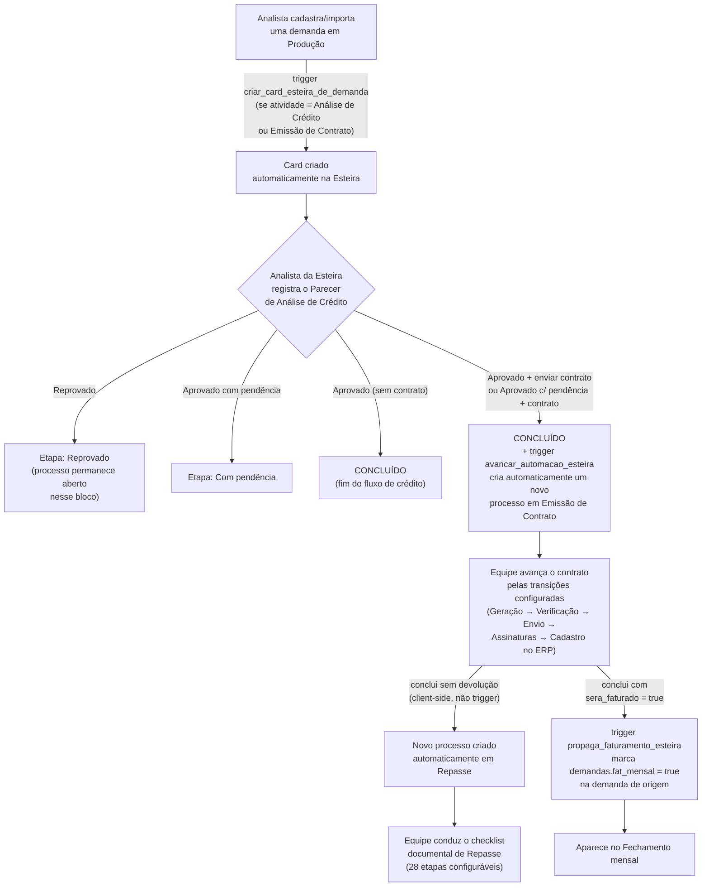
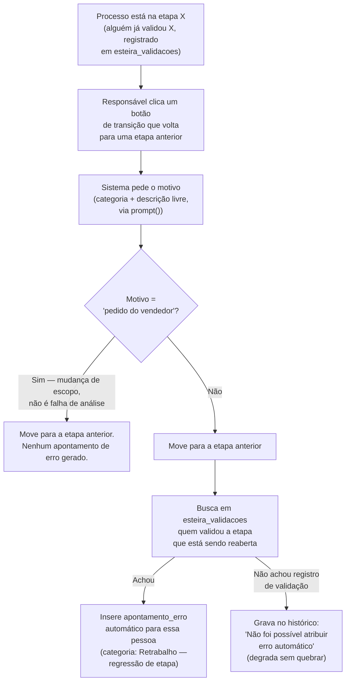
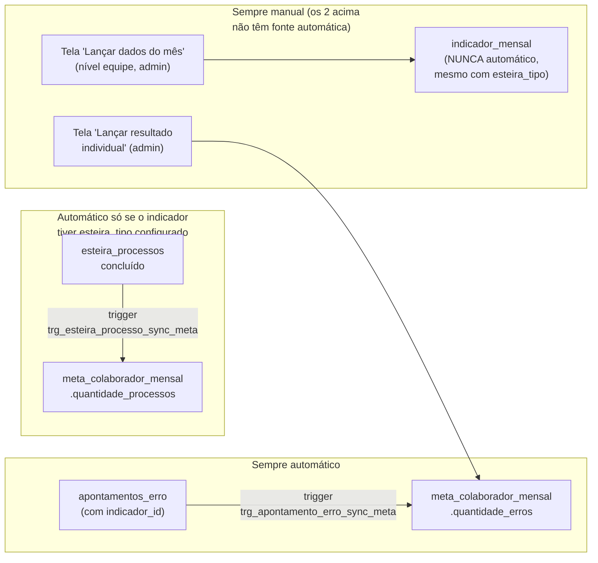
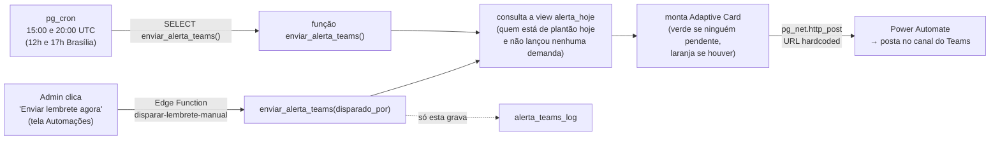
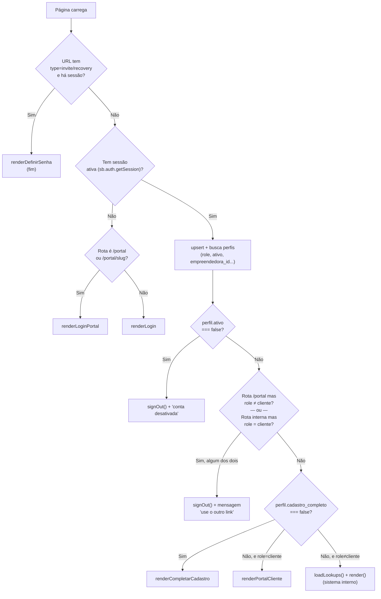
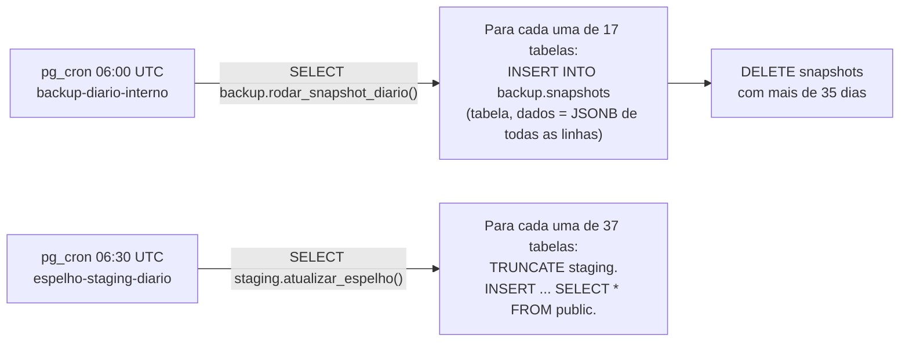
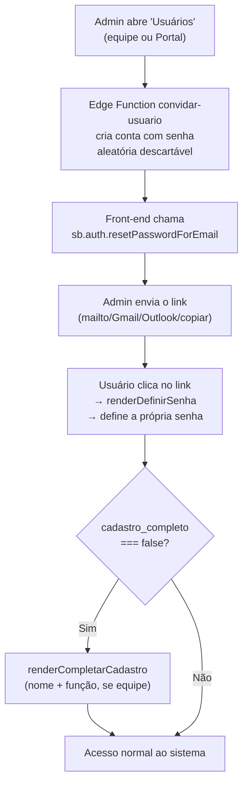
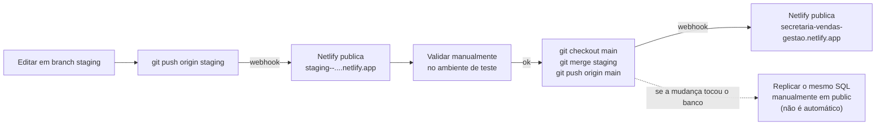

# Fluxos

Diagramas dos processos centrais do sistema, montados a partir do código real (triggers +
`app.js`), não de uma especificação teórica.

## 1. Produção → Esteira → Contrato → Repasse (a cadeia completa)

**Pontos de atenção**: o passo G (trigger de banco) e um caminho alternativo client-side que
dispara quando o **texto** de um botão de transição contém "enviar para Emissão de Contrato"
fazem, na prática, a mesma coisa por dois caminhos independentes — ver
[REGRAS-DE-NEGOCIO.md](REGRAS-DE-NEGOCIO.md#esteira-análise-de-crédito-emissão-de-contrato-repasse).
O passo I (Esteira→Repasse) é 100% client-side, sem trigger correspondente.

## 2. Regressão de etapa → erro automático de retrabalho

## 3. Metas & Indicadores — o que é automático e o que é manual

## 4. Alerta de plantão (Teams)

## 5. Login e roteamento inicial (`init()`)

## 6. Backup e espelhamento diário (dentro do próprio Postgres)

Detalhe de cada um, incluindo como restaurar, em [BACKUP-E-ROLLBACK.md](BACKUP-E-ROLLBACK.md).

## 7. Ciclo de vida de um usuário

## 8. Publicação de uma mudança (staging → produção)

Ver passo a passo textual em [DEPLOY.md](DEPLOY.md#fluxo-normal-de-publicação-de-uma-mudança).

