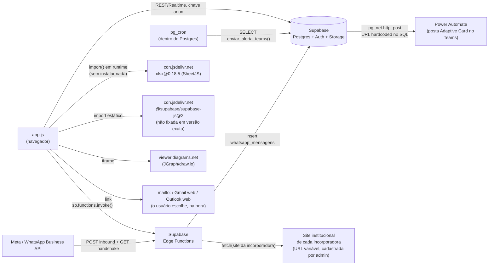

# Integrações e serviços externos

## Mapa de integrações

## Lista de serviços externos

| Serviço | Tipo | Direção | Autenticação | Onde no código |
|---|---|---|---|---|
| **Supabase** | Backend-as-a-Service (Postgres, Auth, Storage, Edge Functions) | bidirecional | chave `anon` (client) / `service_role` (Edge Functions) | `app.js` inteiro, `config.js` |
| **Netlify** | Hospedagem estática + deploy automático | GitHub → Netlify | webhook do GitHub (configurado no Netlify, não no código) | `netlify.toml`, `_headers`, `_redirects` |
| **GitHub** | Controle de versão | — | SSH/HTTPS do desenvolvedor | repositório inteiro |
| **Power Automate** (Microsoft) | Recebe webhook e posta no Microsoft Teams | Postgres → Power Automate | URL com assinatura embutida na própria URL (ver [VARIAVEIS-DE-AMBIENTE.md](VARIAVEIS-DE-AMBIENTE.md)) | função SQL `enviar_alerta_teams()` |
| **WhatsApp Business Platform** (Meta) | Recebe mensagens inbound | Meta → Supabase (webhook) | token de verificação fixo no handshake `GET`; sem verificação de assinatura (`X-Hub-Signature`) no `POST` — ver [SEGURANCA.md](SEGURANCA.md) | Edge Function `whatsapp-webhook` |
| **draw.io / diagrams.net** | Visualizador de fluxogramas embutido via iframe | app.js → viewer.diagrams.net | nenhuma (viewer público, recebe a URL do arquivo `.drawio` por query string) | `renderFluxogramas()` |
| **jsDelivr (CDN)** | Entrega das 2 bibliotecas JS de terceiro | app.js → cdn.jsdelivr.net | nenhuma | `import` no topo de `app.js` (Supabase JS) e `import()` dinâmico em 5 pontos (SheetJS) |
| **Clientes de e-mail do usuário (mailto), Gmail web, Outlook web** | Não é uma integração de verdade — só monta links | app.js → o que o usuário escolher clicar | nenhuma (não há envio de e-mail pelo servidor) | `abrirEnvioEmail`, `abrirEnvioAcessoEmail` |
| **Sites institucionais das incorporadoras** | Leitura de HTML para extrair logo/cor automaticamente | Edge Function → site de terceiro (URL variável, cadastrada pelo admin) | nenhuma — a Edge Function faz um `fetch` simples com timeout de 10s | Edge Function `extrair-identidade-site` |

## Detalhamento dos pontos mais relevantes

### Não há envio de e-mail pelo servidor
Apesar de existir "e-mail de convite", "e-mail de chamado" etc. no vocabulário do sistema, **o
Supabase não dispara e-mail transacional próprio** para esses fluxos (só o de recuperação de
senha nativo do Supabase Auth, `resetPasswordForEmail`, é enviado pelo próprio Supabase). Todo o
resto ("Chamados entre áreas", "convite de usuário") apenas **monta o assunto/corpo** e oferece
ao usuário logado abrir no seu próprio Gmail/Outlook/app local, ou copiar o texto. Se a empresa
que assumir o projeto quiser e-mail transacional de verdade, é uma integração nova a construir
(ex.: Resend, SendGrid, ou SMTP próprio via uma Edge Function).

### WhatsApp é só recepção, não há envio
A Edge Function `whatsapp-webhook` grava toda mensagem recebida em `whatsapp_mensagens`
(`direcao='entrada'`), mas **nenhum ponto do `app.js` chama a API do WhatsApp para enviar
mensagem**, e **nenhuma tela do sistema lê a tabela `whatsapp_mensagens`** (confirmado por busca
em todo o arquivo). Ou seja, hoje mensagens de WhatsApp chegam e ficam gravadas no banco, mas não
há nenhuma interface para vê-las nem para responder. Ver [PENDENCIAS.md](PENDENCIAS.md).

### Dependências via CDN, não via `npm install`
| Biblioteca | Versão | Fixada? | Onde |
|---|---|---|---|
| `@supabase/supabase-js` | `@2` (resolve para `2.112.2` hoje, conferido em 2026-08-08) | **não** — `@2` pega a última versão minor/patch automaticamente | `import` estático, linha 2 de `app.js` |
| `xlsx` (SheetJS) | `0.18.5` | sim, versão exata | `import()` dinâmico, 5 pontos de `app.js` (importação/exportação de planilha) |

Risco prático do Supabase JS não fixado: uma atualização da biblioteca no CDN pode mudar
comportamento (breaking change de uma minor/major) sem que ninguém tenha tocado no código do
projeto. Recomendação: fixar em `@supabase/supabase-js@2.112.2` (ou a versão mais recente
testada) assim que possível.

### draw.io/diagrams.net recebe a URL do arquivo por query string
O visualizador de fluxogramas carrega o arquivo `.drawio` (do próprio deploy do site ou de um
upload no bucket `fluxogramas-uploads`) através de um iframe apontando para
`viewer.diagrams.net`, passando a URL do arquivo como parâmetro. Como o bucket
`fluxogramas-uploads` é **público**, qualquer arquivo enviado ali é acessível por quem tiver a
URL, mesmo sem estar logado no sistema — ver [SEGURANCA.md](SEGURANCA.md).

## Serviços mencionados na documentação existente mas não confirmados no código

Nenhum encontrado além do que já está listado acima — a extensão `supabase_vault` está instalada
no projeto Supabase mas não há uso identificado dela em nenhuma tabela/função do schema
`public`.
